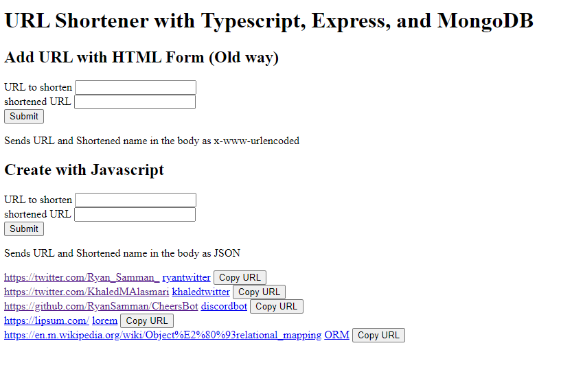

# URLShortner
A challenge between me and [Khaled](https://khaledalasmari.com/) to compare Typescript/Node with Python/Flask, by creating a simple URL Shortener.

I have deployed my version to Heroku, you can try it [here](https://rs-shorten.herokuapp.com/)!
